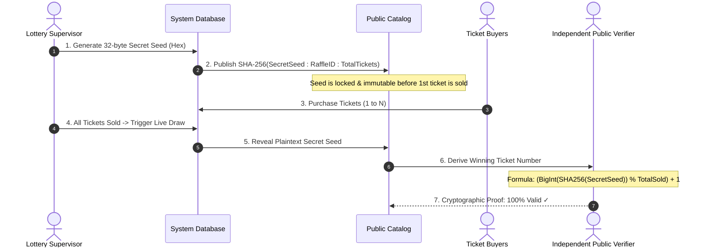
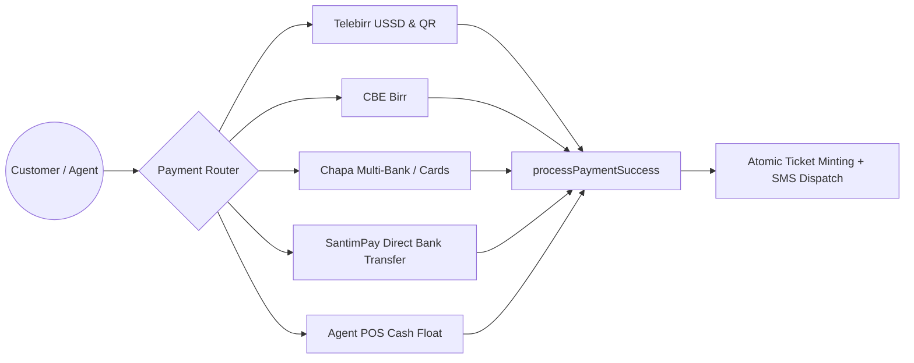
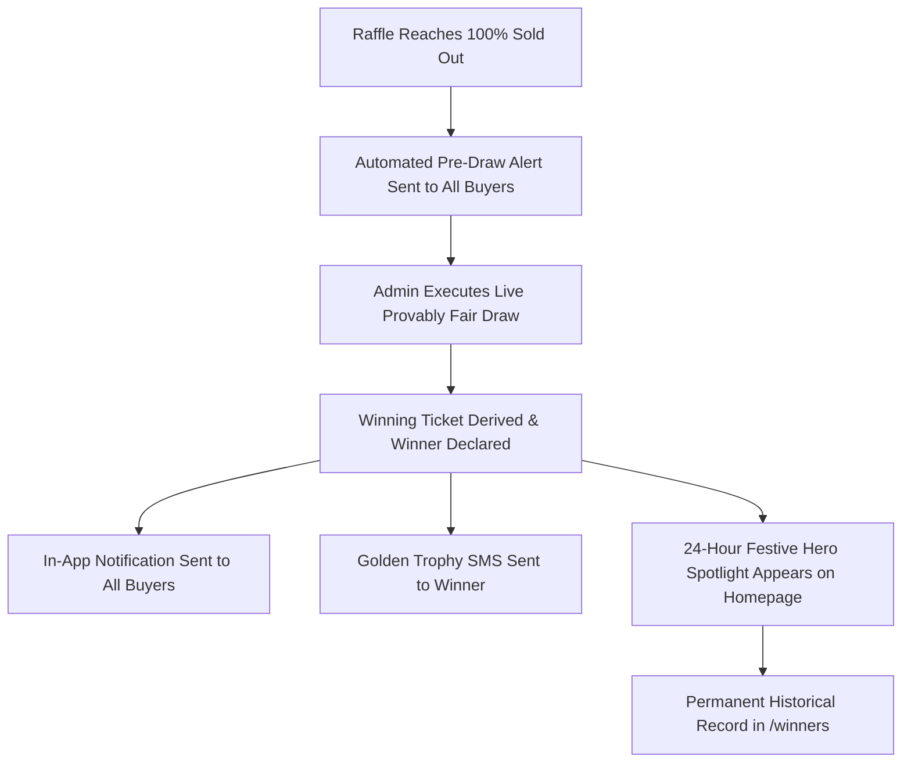

# LuckyEthio Raffle Platform — Complete System Architecture & Operational Guide

---

## 📑 Table of Contents
1. [Executive Summary & System Overview](#1-executive-summary--system-overview)
2. [Monorepo Architecture & Codebase Layout](#2-monorepo-architecture--codebase-layout)
3. [Provably Fair SHA-256 Cryptographic Engine](#3-provably-fair-sha-256-cryptographic-engine)
4. [Concurrency, Anti-Collision & 1-Hour Booking Hold Engine](#4-concurrency-anti-collision--1-hour-booking-hold-engine)
5. [4-State Visual Ticket Matrix](#5-4-state-visual-ticket-matrix)
6. [Payment Gateways & Ethiopian Integrations](#6-payment-gateways--ethiopian-integrations)
7. [Offline GSM USSD State Machine (*157#)](#7-offline-gsm-ussd-state-machine-804)
8. [Authorized Agent Kiosk POS & Float Accounting](#8-authorized-agent-kiosk-pos--float-accounting)
9. [Pre-Draw Alerts & 24-Hour Hero Winner Spotlight](#9-pre-draw-alerts--24-hour-hero-winner-spotlight)
10. [Admin Operations Portal & NLA Audits](#10-admin-operations-portal--nla-audits)
11. [Data Models & Schema Reference](#11-data-models--schema-reference)
12. [Operational Runbook, Commands & Port Map](#12-operational-runbook-commands--port-map)

---

## 1. Executive Summary & System Overview

**LuckyEthio** is an enterprise-grade, provably fair raffle and lottery ticketing platform built specifically for the Ethiopian regulatory and financial ecosystem under National Lottery Administration (NLA) compliance.

### Core Pillars:
- **Zero-Trust Cryptographic Fairness**: Pre-committed SHA-256 RNG hashes ensure mathematical determinism and prevent insider tampering.
- **High-Concurrency Anti-Collision**: In-memory sequential mutex queues ensure zero duplicate tickets and zero overselling even under high peak loads.
- **1-Hour Temporary Reservation Hold**: Unpaid tickets are held exclusively for 60 minutes and automatically returned to the public pool if unpaid.
- **Omnichannel Accessibility**: Online Web Client, Handheld Agent POS Terminals, and Offline Feature Phones via GSM USSD (`*157#`).
- **Ethiopian Payment Ecosystem**: Native support for Telebirr, CBE Birr, Chapa, SantimPay, and Agent Cash.
- **Post-Draw Visibility**: Automated pre-draw notifications to ticket buyers, a 24-hour Hero Section winner celebration spotlight, and permanent public cryptographic archives.

---

## 2. Monorepo Architecture & Codebase Layout

The platform is structured as a **Turborepo Monorepo** powered by Next.js 14 (App Router), Tailwind CSS, Prisma ORM, and SQLite / PostgreSQL.

```
RAFFLE/
├── apps/
│   ├── web/                    # Port 3000: Customer & Agent Web Application
│   │   ├── src/app/            # Routes: /, /raffles/[id], /my-tickets, /winners, /verifier, /agent, /agent/ussd-simulator, /checkout
│   │   ├── src/components/     # UI: HeroWinnerSpotlight, TicketSelector, PaymentSimulatorDrawer, Navbar, Footer
│   │   └── src/app/api/        # Endpoints: /api/raffles, /api/tickets, /api/payments, /api/notifications, /api/ussd
│   │
│   └── admin/                  # Port 3001: Dedicated Admin & NLA Operations Console
│       ├── src/app/            # Routes: /, /raffles, /agents, /draws, /financials, /audits, /settings
│       ├── src/components/     # UI: AdminShell (Responsive mobile drawer + desktop sidebar), AdminHeader
│       └── src/app/api/        # Endpoints: /api/draws/execute, /api/raffles, /api/agents, /api/financials
│
├── packages/
│   ├── database/               # Shared Prisma Schema, SQLite client, Seed migrations
│   │   └── prisma/             # schema.prisma, seed.ts, dev.db
│   │
│   └── shared/                 # Shared TypeScript Business Logic
│       └── src/
│           ├── provably-fair.ts # SHA-256 Commit-Reveal RNG & Public Verifier Math
│           ├── concurrency.ts   # Concurrency Queue, Atomic Minting, 1-Hour Hold Engine
│           ├── payment.ts       # Multi-Gateway Adapters, Webhooks & Idempotency
│           ├── ussd.ts          # GSM USSD *157# State Machine
│           ├── auth-types.ts    # Demo Personas (Admins, Agents, Customers)
│           └── i18n/            # Bilingual dictionaries (English & Amharic አማርኛ)
│
├── scripts/
│   └── test-platform.ts        # Comprehensive 5-part automated test suite
├── turbo.json                  # Turborepo task pipeline
└── package.json                # Root npm workspaces
```

---

## 3. Provably Fair SHA-256 Cryptographic Engine

Traditional lotteries require users to blind-trust operators. **LuckyEthio** enforces mathematical zero-trust through the **SHA-256 Commit-Reveal Scheme**:



### Mathematical Formulas:
1. **Pre-Commitment Hash (Published at Raffle Creation)**:
   $$\text{CommitHash} = \text{SHA256}(\text{SecretSeed} \parallel \text{RaffleID} \parallel \text{TotalTickets})$$
2. **Deterministic Winner Derivation (Executed at Live Draw)**:
   $$\text{WinningTicketNumber} = \left(\text{BigInt}\left(\text{SHA256}(\text{SecretSeed})\right) \pmod{\text{TotalSoldTickets}}\right) + 1$$

---

## 4. Concurrency, Anti-Collision & 1-Hour Booking Hold Engine

To prevent race conditions when thousands of buyers compete for popular numbers (e.g. #7, #77, #777) or volume quick-picks:

### In-Memory Mutex Queue
Each raffle maintains a dedicated in-memory promise queue (`ConcurrencyQueue` in `packages/shared/src/concurrency.ts`). All selection, reservation, and purchase operations run sequentially inside atomic database transactions.

### 1-Hour Booking Hold Window:
1. When a user chooses numbers and proceeds to checkout, the system atomically reserves the numbers (`status: 'RESERVED'`, `reservedUntil = now + 60 minutes`).
2. **Exclusivity**: Other buyers cannot pick or reserve these numbers during the 60-minute hold.
3. **Settlement**:
   - **Payment completed within 60 min**: The tickets transition to `status: 'CONFIRMED'`, and official QR receipts are minted.
   - **60 min elapsed without payment**: The hold auto-expires (`cleanupExpiredReservations`). The numbers instantly return to the remaining available pool for other buyers.

---

## 5. 4-State Visual Ticket Matrix

The custom ticket selector provides instant visual feedback across all device viewports:

| State | Color & Badge | Interactive Behavior | Tooltip |
| :--- | :--- | :--- | :--- |
| ⚪ **Available** | White card, slate border, green hover outline | Clickable, selectable by customer | `Ticket #X Available` |
| 🟢 **Selected** | Vibrant Emerald (`bg-emerald-600`), checkmark `✓` badge | Active in user's current checkout | `Ticket #X Selected` |
| 🟡 **Booked (1hr)** | Amber background (`bg-amber-100`), clock `⏳` icon | Locked by an in-flight buyer, unpickable | `Ticket #X is BOOKED (1-hr hold)` |
| 🔴 **Sold** | Muted dark-slate (`bg-slate-200`), strikethrough, padlock `🔒` | Permanently purchased, disabled | `Ticket #X is SOLD` |

---

## 6. Payment Gateways & Ethiopian Integrations

The platform features unified adapters for Ethiopia’s leading mobile wallets and digital payment processors:



### Idempotency & Webhooks:
- Each checkout generates a unique transaction reference (e.g. `TX-8B39FA01CD`).
- Webhook endpoints verify HMAC-SHA256 signatures (`verifyWebhookSignature`).
- Instant simulation drawers allow testing both `SUCCESS` and `FAILED` callbacks in sandbox mode.

---

## 7. Offline GSM USSD State Machine (`*157#`)

For rural customers and kiosk agents operating in areas with limited smartphone or data connectivity:

- **Protocol**: GSM USSD Session over `*157#`.
- **Bandwidth**: 0 KB mobile data usage, compatible with basic 2G feature phones (Nokia, Tecno).
- **Session Menus**:
  - `1. Browse Active Raffles` $\rightarrow$ Select prize and view ticket price.
  - `2. Buy Ticket with Telebirr` $\rightarrow$ Instant mobile money debit.
  - `3. Check My Tickets` $\rightarrow$ Lists purchased ticket numbers and codes via USSD.
  - `4. Check Live Draw Results` $\rightarrow$ View latest winning ticket numbers.
  - `5. Agent POS Mode` $\rightarrow$ Unlocked automatically when authorized Agent SIM dials `*157#` to sell tickets using their cash float balance.

---

## 8. Authorized Agent Kiosk POS & Float Accounting

Local retail kiosks and walk-in agents sell physical/digital tickets across Ethiopian cities:

### 1. Agent KYC Verification & Approval
- Agents register with business name, national ID, and location (Addis Ababa, Hawassa, Bahir Dar, etc.).
- Admin reviews and approves agents inside the Admin Portal (`/agents`).

### 2. Double-Entry Float Ledger
- **Prepaid Wallet Mode**: Agent tops up float (e.g. 5,000 ETB) via Telebirr/CBE.
- **Walk-in Cash Sale**: Agent collects cash from a customer and clicks *Sell Tickets*.
- **Atomic Balance Deduction**: System deducts ticket cost from float and automatically credits the agent's commission (e.g. 5%–10% instant accrual).
- **Ledger Entries**: Every top-up and deduction is logged in `AgentLedger` with balance-after audit snapshots.

---

## 9. Pre-Draw Alerts & 24-Hour Hero Winner Spotlight



### 1. Pre-Draw & Post-Draw In-App Notifications
- **Pre-Draw**: Ticket buyers receive alert: *"All tickets sold! Draw is starting soon. Check your ticket numbers in My Tickets."*
- **Post-Draw**: All buyers receive draw completion notice with the winning ticket number. The winner receives a celebration alert.
- **Notification Bell**: Positioned in top navigation with unread count badge.

### 2. 24-Hour Hero Winner Spotlight Banner
- Appears prominently at the top of the homepage (`/`) for **24 hours** after a draw is completed.
- Displays confetti shower, winner name, masked phone (`+251912***678`), prize photo, winning ticket number `#XXX`, live 24-hour remaining countdown, and direct 1-click link to the cryptographic verifier.

### 3. Permanent History Archives
- **Winners Hall (`/winners`)**: Complete historical record of all completed raffles, prizes, draw dates, winning ticket numbers, and NLA verification certificates.
- **My Tickets (`/my-tickets`)**: Customer's personal ticket history with `WINNER!` ribbons and digital QR receipts.

---

## 10. Admin Operations Portal & NLA Audits

Accessible on port **3001** (`http://localhost:3001`) with dedicated dark operations theme:

1. **Dashboard & Telemetry (`/`)**: Real-time sales velocity, total revenue, commission payouts, and active vs drawn raffles.
2. **Raffle Management (`/raffles`)**: Create new raffles, upload prize imagery, set ticket prices/capacities, and pre-commit SHA-256 secret seeds.
3. **Agent Roster & KYC (`/agents`)**: Approve/suspend agents, adjust commission rates, and top up agent floats.
4. **Live Provably Fair Draw Console (`/draws`)**: Live reveal console for supervisor-triggered draws with deterministic winner computation.
5. **Financial Ledger & Settlement (`/financials`)**: Complete financial ledger reconciling gross ticket sales, agent commission payouts, and lottery proceeds.
6. **Regulatory Audit Trail (`/audits`)**: National Lottery Administration (NLA) compliance logs recording all administrative actions with cryptographic signatures.
7. **Statutory Settings (`/settings`)**: Configure NLA permit numbers, gateway API keys, and VAT/statutory tax parameters.

---

## 11. Data Models & Schema Reference

Key Prisma models located in `packages/database/prisma/schema.prisma`:

- `User`: Accounts (Customer, Agent, Admin, Super Admin) with phone authentication.
- `Agent`: Agent profiles, float balances, credit limits, tiers, and commission rates.
- `AgentLedger`: Immutable financial ledger for agent top-ups, sales deductions, and commission accruals.
- `Raffle`: Raffle lifecycle (`DRAFT`, `ACTIVE`, `CLOSED`, `DRAWN`), pricing, SHA-256 pre-commit hash, secret seed, revealed seed, winner ticket reference, and `drawnAt` timestamp.
- `Ticket`: Number allocations, verification codes, statuses (`CONFIRMED`, `RESERVED`, `REFUNDED`, `EXPIRED`), `reservedUntil` timestamp, and `reservedByPhone`.
- `Transaction`: Multi-gateway payment records, status (`PENDING`, `SUCCESS`, `FAILED`, `EXPIRED`), and `expiresAt` timestamps.
- `DrawAudit`: Permanent cryptographic audit record linking revealed seed, winning ticket, formula, and auditor verification.
- `Notification`: In-app buyer alerts (`PRE_DRAW_ALERT`, `WINNER_ANNOUNCEMENT`, `TICKET_MINTED`).
- `USSDSession`: GSM session state for offline `*157#` dialing.

---

## 12. Operational Runbook, Commands & Port Map

### Service Ports:
- **Customer / Agent Web Portal**: `http://localhost:3000`
- **Admin Operations Console**: `http://localhost:3001`

### CLI Commands:
```bash
# 1. Install all monorepo dependencies
npm install

# 2. Sync SQLite database schema
npm run db:push

# 3. Seed database with realistic Ethiopian raffles, agents, and drawn winner
npm run db:seed

# 4. Run automated 5-part platform test suite
./node_modules/.bin/tsx scripts/test-platform.ts

# 5. Start both Web and Admin applications concurrently
npm run dev

# 6. Production build check
npm run build
```

### Pre-Configured Demo Accounts:
| Persona | Name | Role | Phone Number | Access Portal |
| :--- | :--- | :--- | :--- | :--- |
| **Super Admin** | Abebe Kebede | `SUPER_ADMIN` | `+251911000000` | Admin Console (:3001) |
| **Lottery Admin** | Sara Haile | `ADMIN` | `+251911000001` | Admin Console (:3001) |
| **Kiosk Agent** | Dawit Tadesse | `AGENT` | `+251912345678` | Web POS / USSD (:3000) |
| **Customer** | Helen Tesfaye | `CUSTOMER` | `+251933445566` | Web Client (:3000) |
| **Customer** | Yohannes Girma | `CUSTOMER` | `+251944556677` | Web Client (:3000) |

